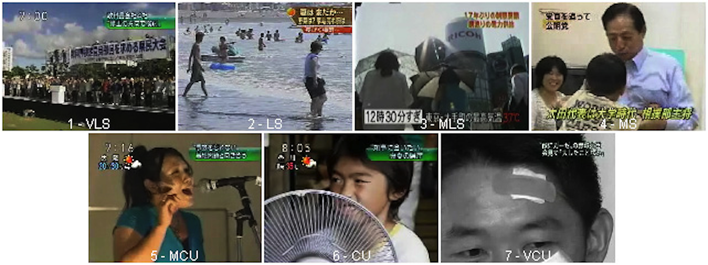
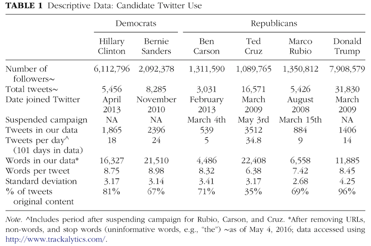

# Content analysis
     
## A Brief Introduction

---

**Scott Koga-Browes**

- 1991-2005: Television News Production
    - TBS, NTV, Reuters, freelance (NHK etc)
- 2005-6: MA Media Studies (Sheffield Hallam)
- 2006-9: PhD News Media in Japan (Sheffield)
- 2009-11: JSPS Fellowship (Kyushu)
- 2012- : Ritsumeikan College of IR

---
## Outline

- Content Analysis: Why and How
- A Personal Example
- Q&A

---
## Uses of Content Analysis

### In theory, anything that leaves a recordable trace in the world

- Personal Conversations
- Dancing (expressive movements)
- The Fine or Practical arts
- Govt. Papers (eg. policy documents etc )
- **(Mass) Media**

---
## Alternative approaches

- Semiological Analysis
    - Useful for 'multimodal' texts such as tv or film
    - 'presupposes a thorough knowledge of the originating  culture and of the particular genre at issue' (McQuail p348)

- (Critical) Discourse analysis
    - generally deal with different modes communication on a certain issue
    - 'qualitative content analysis' (?)

---
## A Communication Model

"**Who** says **what** to **whom** in what channel with what effect?"

- **Producers**
    - People and organisations who create media products <!-- .element: class="fragment "-->
- **Texts**
    - All the stuff made by producers <!-- .element: class="fragment "-->
- **Audiences**
    - All the people who 'consume' the created texts <!-- .element: class="fragment "-->

---

## Dealing with Texts

- Why is looking at 'texts' the right way to answer your question?
    - Might it make more sense to look somewhere else for the answer? <!-- .element: class="fragment "-->
- What is it 'in' the texts that provides evidence for your argument? <!-- .element: class="fragment "-->
    - When you view/read your texts what part of the 'manifest reality' are you looking for? <!-- .element: class="fragment "-->

---

## Choosing a sample

- Which texts are relevant and appropriate?
- Sampling Techniques
    - Avoiding biases
    - Preventing distortions
- Availability
    - Can you actually get hold of the relevant texts?

---

## 'Focus' or 'representativeness'

*What is the aim of your sample?*
- Focus texts connected to a certain idea or event?
    - Eg. Changes in the **New York Times** coverage of human rights issues
- Are you more interested getting a representative sample of a certain channel or medium?
    - Eg. What language do women's magazines in Japan to discuss 'motherhood'?

---

## Coding and 'Data-fying'

- 'Reliability'
    - Could someone else repeat your research and get the same results? <!-- .element: class="fragment "-->
- Validity
    - Something to aim for! <!-- .element: class="fragment "-->
- "Quality"
- "**What** are you going to code, **how** and **why**?"

---

## Validity

> ...that quality of research results that leads us to accept them as true, as speaking about the real world[...] A measuring instrument is considered valid if it measures what its user claims it measures. **A content analysis is valid if the inferences drawn from the available texts withstand the test of independently available evidence**, of new observations, of competing theories or interpretations... (Krippendorff, p313)

---
## Choosing Categories

What are the 'things' (categories) you are looking for (and counting) in your texts?

- are they 'valid'?
- have you created them (for your own benefit), or do they already exist 'in the text' (or the genre to which the texts belong)?

---
## A Personal Example...

- E.T.Hall, "The Hidden Dimension"
    - Proxemics / personal distance
    - intimate, personal, public

- Kress & van Leeuwen (2006) "Reading Images"
    - Use of images to create an imagined relationship between 'image' (portrayed) and viewer.

---
## Choosing a sample

I wanted to talk about:

- 'television news in Japan', so I had to take a sample of 'television news in Japan'

- (ultimately) representations of power in Japanese society.

---
## Choosing a sample

There are lots of news programs (though saying whether something is a 'news program' is sometimes difficult!) in Japan. **Which to choose?**

- Television news that Japanese people choose to watch <!-- .element: class="fragment "-->
- Highest rated programmes across all major networks (otherwise the sample would be dominated by NHK) <!-- .element: class="fragment "-->

---
## Choosing a sample

A daily (or weekly) show has 'editions'. **Which to choose?**

- Need to take a 'representative' sample
- Need to try to **avoid** possible biases in the sample
  - Television shows may have a certain 'schedule' (Eg. An 'entertainment' segment every Thursday)
  - At certain periods big stories may dominate coverage skewing the sample (eg. the Osaka G20)

---
## Choosing a sample

- Top rated shows (based on an average rating taken over several previous months) <!-- .element: class="fragment "-->
- At least one show from each major network <!-- .element: class="fragment "-->
- Two 'rolling weeks' during a period with no major 'media events' <!-- .element: class="fragment "-->
  - ie. Monday of week1, Tuesday of week 2, etc etc
  - led to a very complex recording schedule!

---
## Choosing a sample

News programs (we now have a sample!) are divided up into 'stories'. **Which to choose?**

- Only 'news' (no sport, weather etc)
- Only edited video 'packages'(2–4 min)
- Only domestic news

Resulted in a corpus of about 70 stories which are representative of images that a news viewer in Japan would typically encounter.

---

## Coding (Data-fication!)

Stories are divided in to 'cuts'

One 'cut' however is not the same as one 'image'

How to deal with 'moving images'?

- 'Arbitrary' decision to code 'start' and 'end' of cut (based largely on personal professional knowledge)

---

## 'Social Distance' & 'Framing'

**Theoretical background to framing**: Hall suggests a series of distances at which changes to 'personal space' take place, these match closely standard shot sizes used in television.

Kress and van Leeuwen talk about 'closeness' being related to power relations.

---

## (My) Coding Scheme

Define features and categories:

- Framing
    - Used to construct a 'social distance' between the 'portrayed' and viewers
    - Categories: XCU, CU, MCU, MS, MLS, LS, VLS
- Camera Angles
    - Can imply a certain power relation between observer and observed
    - **Horizontal:** Full-face, half-face, profile, rear
    - **Vertical:** V Low, Low, Eye-level, High, V High

---
## Framing encoding

---

## Framing encoding

---

## Findings

A (traditional) content analysis results in a lot of numbers, often frequency counts.

You have effectively (justifiably?) simplified a large selection of complex data into a much simpler form.

**Content analysis is a fairly blunt instrument!**

---

## Analysis

---
## Relating Data

---
## Online tools

<iframe data-src="https://voyant-tools.org/" style="width:900px;height:500px;"></iframe>

---

## Data set sizes

---

   

## Thanks for your time!

Questions please!

----

- **References**
    - Hall, E. T. (1990[1966]). *The Hidden Dimension*. Anchor Books, New York.
    - Kress, G. R. and van Leeuwen, T. (2006). *Reading images: The grammar of visual design*. Routledge, London, 2nd edition.
    - Krippendorff, K. (2018). *Content analysis: An introduction to its methodology*. Sage publications.
    - Ryoo, J. H. and Bendle, N. (2017). Understanding the social media strategies of U.S. primary candidates. *Journal of Political Marketing*, 16(3-4):244–266
